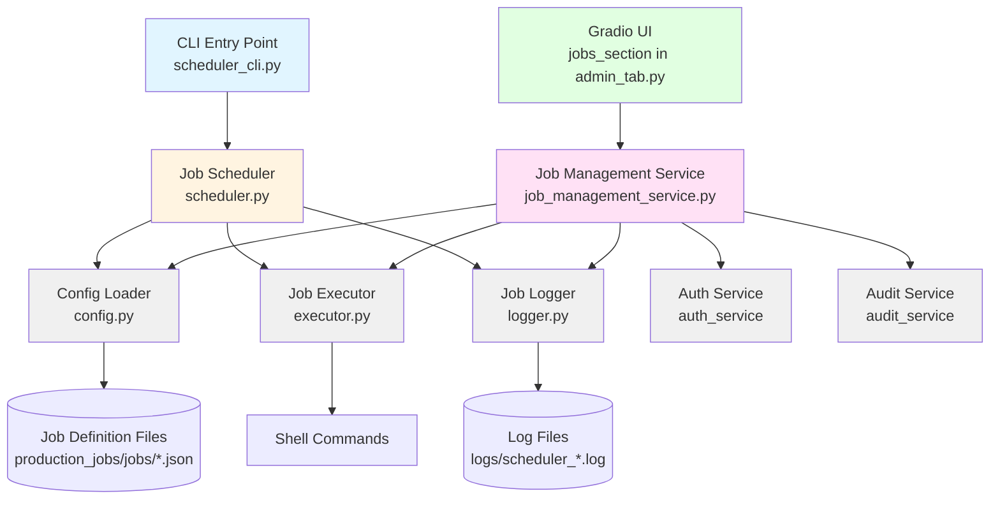
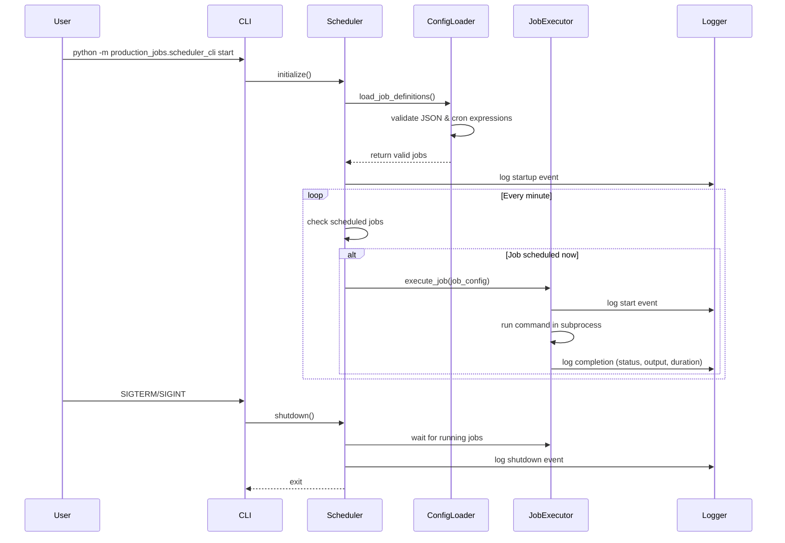
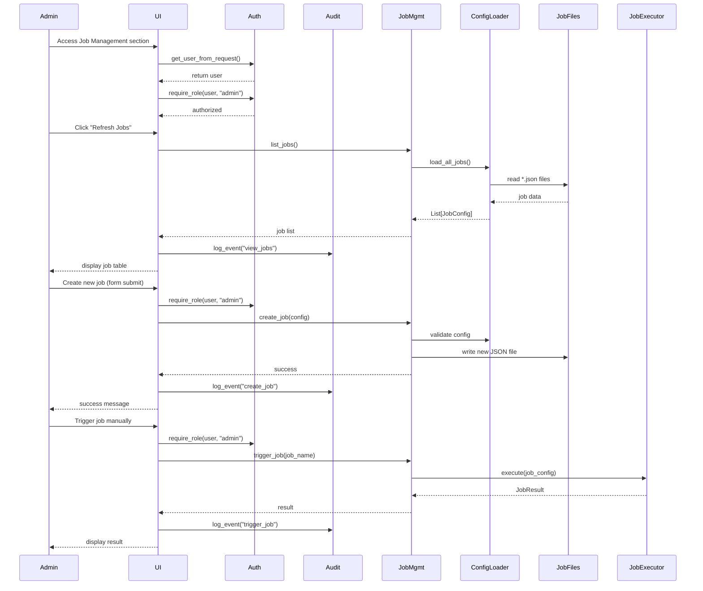

# Design Document: Production Jobs Scheduler

## Overview

The Production Jobs Scheduler is a standalone Python daemon that manages automated execution of maintenance and data processing tasks on configurable cron schedules. The system operates independently from the main Gradio application, providing reliable job execution with comprehensive logging and monitoring capabilities.

The scheduler follows a modular architecture with clear separation between configuration management, scheduling logic, job execution, and logging. It uses the `schedule` library for cron-based scheduling and implements graceful shutdown handling to ensure running jobs complete before termination.

Key design principles:
- **Independence**: Runs as a separate process from the main application
- **Reliability**: Graceful shutdown, error handling, and comprehensive logging
- **Simplicity**: JSON-based configuration, standard cron expressions
- **Observability**: Detailed execution logs with timestamps, status, and output capture

## Architecture

### System Components



### Directory Structure

```
production_jobs/
├── __init__.py
├── scheduler_cli.py       # CLI entry point
├── scheduler.py           # Main scheduler logic
├── config.py              # Configuration loader and validator
├── executor.py            # Job execution engine
├── logger.py              # Logging utilities
├── job_management_service.py  # Service layer for UI/API
├── jobs/                  # Job definition files
│   └── example_job.json   # Example configuration (disabled)
└── README.md              # Documentation

components/
└── admin_tab.py           # Admin UI with jobs_section

logs/
├── scheduler_main.log     # Scheduler lifecycle events
└── scheduler_jobs.log     # Job execution history
```

### Process Flow



### UI Interaction Flow



## Components and Interfaces

### 1. Configuration Loader (`config.py`)

Responsible for reading, parsing, and validating job definition files.

**Interface:**
```python
class JobConfig:
    """Represents a validated job configuration."""
    name: str
    schedule: str  # cron expression
    command: str
    working_directory: str
    enabled: bool
    
    def validate_cron(self) -> bool:
        """Validate cron expression syntax."""
        pass

class ConfigLoader:
    """Loads and validates job configurations from JSON files."""
    
    def __init__(self, jobs_directory: str):
        """Initialize with path to jobs directory."""
        pass
    
    def load_all_jobs(self) -> List[JobConfig]:
        """Load all job definitions from the jobs directory.
        
        Returns:
            List of valid JobConfig objects (skips invalid files with logging)
        """
        pass
    
    def _parse_job_file(self, filepath: Path) -> Optional[JobConfig]:
        """Parse a single job definition file.
        
        Returns:
            JobConfig if valid, None if invalid (logs errors)
        """
        pass
```

**Job Definition Schema:**
```json
{
  "name": "string (required)",
  "schedule": "string (required, cron format: minute hour day month weekday)",
  "command": "string (required, shell command to execute)",
  "working_directory": "string (required, absolute or relative path)",
  "enabled": "boolean (required, false to disable)"
}
```

**Validation Rules:**
- All fields must be present
- `schedule` must be valid 5-field cron expression
- `working_directory` must exist
- Invalid files are logged and skipped (non-fatal)

### 2. Job Executor (`executor.py`)

Executes job commands and captures output.

**Interface:**
```python
class JobResult:
    """Result of a job execution."""
    job_name: str
    start_time: datetime
    end_time: datetime
    exit_code: int
    stdout: str
    stderr: str
    duration_seconds: float
    
    @property
    def success(self) -> bool:
        """Returns True if exit code is 0."""
        pass

class JobExecutor:
    """Executes job commands in subprocesses."""
    
    def execute(self, job_config: JobConfig) -> JobResult:
        """Execute a job and return the result.
        
        Args:
            job_config: The job configuration to execute
            
        Returns:
            JobResult with execution details
        """
        pass
    
    def _run_command(self, command: str, cwd: str) -> Tuple[int, str, str]:
        """Run shell command and capture output.
        
        Returns:
            Tuple of (exit_code, stdout, stderr)
        """
        pass
```

**Execution Details:**
- Uses `subprocess.run()` with timeout protection
- Captures both stdout and stderr
- Sets working directory from job config
- Records precise timing information
- Handles command failures gracefully

### 3. Job Logger (`logger.py`)

Manages structured logging for scheduler events and job execution.

**Interface:**
```python
class JobLogger:
    """Handles logging for scheduler and job execution."""
    
    def __init__(self, log_directory: str):
        """Initialize loggers for main scheduler and job execution."""
        pass
    
    def log_startup(self, num_jobs: int):
        """Log scheduler startup event."""
        pass
    
    def log_shutdown(self):
        """Log scheduler shutdown event."""
        pass
    
    def log_job_start(self, job_name: str):
        """Log job execution start."""
        pass
    
    def log_job_complete(self, result: JobResult):
        """Log job execution completion with full details."""
        pass
    
    def log_config_error(self, filepath: str, error: str):
        """Log configuration file parsing error."""
        pass
    
    def log_schedule_error(self, job_name: str, error: str):
        """Log scheduling error."""
        pass
```

**Log Format:**
- Timestamp (ISO 8601)
- Log level (INFO, WARNING, ERROR)
- Component name
- Message with structured data

**Log Files:**
- `scheduler_main.log`: Lifecycle events (startup, shutdown, errors)
- `scheduler_jobs.log`: Job execution history (start, completion, output)

**Log Rotation:**
- Uses `RotatingFileHandler` with 10MB max size
- Keeps 5 backup files
- Prevents unbounded disk usage

### 4. Job Scheduler (`scheduler.py`)

Core scheduling engine that coordinates all components.

**Interface:**
```python
class JobScheduler:
    """Main scheduler that coordinates job execution."""
    
    def __init__(self, jobs_directory: str, log_directory: str):
        """Initialize scheduler with configuration and logging."""
        pass
    
    def start(self):
        """Start the scheduler daemon.
        
        - Loads job configurations
        - Registers jobs with schedule library
        - Enters main scheduling loop
        - Handles graceful shutdown on SIGTERM/SIGINT
        """
        pass
    
    def _register_jobs(self, jobs: List[JobConfig]):
        """Register jobs with the schedule library."""
        pass
    
    def _execute_job_wrapper(self, job_config: JobConfig):
        """Wrapper that executes job and logs results."""
        pass
    
    def _run_scheduler_loop(self):
        """Main loop that checks and runs scheduled jobs."""
        pass
    
    def shutdown(self):
        """Gracefully shutdown scheduler.
        
        - Sets shutdown flag
        - Waits for running jobs to complete
        - Logs shutdown event
        """
        pass
```

**Scheduling Strategy:**
- Uses `schedule` library for cron-like scheduling
- Checks for pending jobs every second
- Non-blocking execution (jobs run in main thread sequentially)
- Graceful shutdown waits for current job to complete

**Signal Handling:**
- Registers handlers for SIGTERM and SIGINT
- Sets shutdown flag to exit main loop
- Ensures clean termination

### 5. CLI Entry Point (`scheduler_cli.py`)

Command-line interface for managing the scheduler.

**Interface:**
```python
def main():
    """CLI entry point for scheduler management.
    
    Commands:
        start: Start the scheduler daemon
        
    Usage:
        python -m production_jobs.scheduler_cli start
    """
    pass
```

**CLI Design:**
- Simple command-based interface
- Validates command-line arguments
- Provides clear error messages
- Returns appropriate exit codes

### 6. Job Management Service (`job_management_service.py`)

Provides programmatic interface for managing jobs through the UI or API.

**Interface:**
```python
class JobManagementService:
    """Service for managing job configurations and execution."""
    
    def __init__(self, jobs_directory: str, log_directory: str):
        """Initialize service with paths to jobs and logs."""
        pass
    
    def list_jobs(self) -> List[JobConfig]:
        """List all job configurations.
        
        Returns:
            List of all JobConfig objects (enabled and disabled)
        """
        pass
    
    def get_job_history(self, job_name: str, limit: int = 100) -> List[JobResult]:
        """Get execution history for a specific job.
        
        Args:
            job_name: Name of the job
            limit: Maximum number of results to return
            
        Returns:
            List of JobResult objects, most recent first
        """
        pass
    
    def enable_job(self, job_name: str) -> None:
        """Enable a job by setting enabled=true in its config.
        
        Args:
            job_name: Name of the job to enable
            
        Raises:
            JobNotFoundError: If job doesn't exist
        """
        pass
    
    def disable_job(self, job_name: str) -> None:
        """Disable a job by setting enabled=false in its config.
        
        Args:
            job_name: Name of the job to disable
            
        Raises:
            JobNotFoundError: If job doesn't exist
        """
        pass
    
    def trigger_job(self, job_name: str) -> JobResult:
        """Manually trigger immediate execution of a job.
        
        Args:
            job_name: Name of the job to execute
            
        Returns:
            JobResult with execution details
            
        Raises:
            JobNotFoundError: If job doesn't exist
        """
        pass
    
    def create_job(self, config: JobConfig) -> None:
        """Create a new job configuration.
        
        Args:
            config: Job configuration to create
            
        Raises:
            JobAlreadyExistsError: If job with same name exists
            ValidationError: If config is invalid
        """
        pass
    
    def update_job(self, job_name: str, config: JobConfig) -> None:
        """Update an existing job configuration.
        
        Args:
            job_name: Name of the job to update
            config: New job configuration
            
        Raises:
            JobNotFoundError: If job doesn't exist
            ValidationError: If config is invalid
        """
        pass
    
    def delete_job(self, job_name: str) -> None:
        """Delete a job configuration.
        
        Args:
            job_name: Name of the job to delete
            
        Raises:
            JobNotFoundError: If job doesn't exist
        """
        pass
    
    def get_job_logs(self, job_name: str, limit: int = 1000) -> List[dict]:
        """Get log entries for a specific job.
        
        Args:
            job_name: Name of the job
            limit: Maximum number of log entries to return
            
        Returns:
            List of log entry dictionaries, most recent first
        """
        pass
```

**Service Responsibilities:**
- Wraps ConfigLoader, JobExecutor, and Logger for UI access
- Provides CRUD operations for job configurations
- Parses log files to extract job history
- Validates all inputs before performing operations
- Thread-safe for concurrent UI requests

### 7. Job Management UI (`components/admin_tab.py` - jobs_section)

Gradio-based web interface for managing scheduled jobs, integrated into the admin panel.

**UI Components:**

```python
def create_jobs_section() -> gr.Accordion:
    """Create the job management UI section.
    
    Returns:
        Gradio Accordion component containing all job management UI
    """
    pass
```

**UI Layout:**

```
Job Management (Accordion)
├── Job List Section
│   ├── Refresh Button
│   ├── Job List Table (name, status, schedule, last_run, next_run, enabled)
│   └── Action Buttons Row
│       ├── Enable Button
│       ├── Disable Button
│       ├── Trigger Now Button
│       └── Delete Button (with confirmation)
│
├── Job Form Section (Tabs)
│   ├── Create New Job Tab
│   │   ├── Job Name Input
│   │   ├── Schedule Input (cron expression)
│   │   ├── Command Input
│   │   ├── Working Directory Input
│   │   ├── Enabled Checkbox
│   │   └── Create Button
│   │
│   └── Edit Job Tab
│       ├── Select Job Dropdown
│       ├── Job Name Input (read-only)
│       ├── Schedule Input
│       ├── Command Input
│       ├── Working Directory Input
│       ├── Enabled Checkbox
│       └── Update Button
│
├── Job History Section
│   ├── Select Job Dropdown
│   ├── Filter Controls (date range, status)
│   ├── Refresh Button
│   └── History Table (timestamp, status, duration, exit_code)
│
└── Log Viewer Section
    ├── Select Job Dropdown
    ├── Search Input
    ├── Filter Dropdown (all, success, failure)
    ├── Refresh Button
    ├── Log Display (scrollable text area)
    └── Download Logs Button
```

**Event Handlers:**

```python
def on_refresh_jobs(user_session) -> pd.DataFrame:
    """Refresh job list table."""
    user = auth_service.get_user_from_request(user_session)
    require_role(user, "admin")
    jobs = job_management_service.list_jobs()
    audit_service.log_event(user.username, "view_jobs", {"count": len(jobs)})
    return format_jobs_table(jobs)

def on_enable_job(job_name: str, user_session) -> str:
    """Enable a job."""
    user = auth_service.get_user_from_request(user_session)
    require_role(user, "admin")
    job_management_service.enable_job(job_name)
    audit_service.log_event(user.username, "enable_job", {"job_name": job_name})
    return f"Job '{job_name}' enabled successfully"

def on_disable_job(job_name: str, user_session) -> str:
    """Disable a job."""
    user = auth_service.get_user_from_request(user_session)
    require_role(user, "admin")
    job_management_service.disable_job(job_name)
    audit_service.log_event(user.username, "disable_job", {"job_name": job_name})
    return f"Job '{job_name}' disabled successfully"

def on_trigger_job(job_name: str, user_session) -> str:
    """Manually trigger a job."""
    user = auth_service.get_user_from_request(user_session)
    require_role(user, "admin")
    result = job_management_service.trigger_job(job_name)
    audit_service.log_event(user.username, "trigger_job", {
        "job_name": job_name,
        "exit_code": result.exit_code,
        "duration": result.duration_seconds
    })
    return format_job_result(result)

def on_create_job(name: str, schedule: str, command: str, 
                  working_dir: str, enabled: bool, user_session) -> str:
    """Create a new job."""
    user = auth_service.get_user_from_request(user_session)
    require_role(user, "admin")
    config = JobConfig(name, schedule, command, working_dir, enabled)
    job_management_service.create_job(config)
    audit_service.log_event(user.username, "create_job", {"job_name": name})
    return f"Job '{name}' created successfully"

def on_update_job(job_name: str, schedule: str, command: str,
                  working_dir: str, enabled: bool, user_session) -> str:
    """Update an existing job."""
    user = auth_service.get_user_from_request(user_session)
    require_role(user, "admin")
    config = JobConfig(job_name, schedule, command, working_dir, enabled)
    job_management_service.update_job(job_name, config)
    audit_service.log_event(user.username, "update_job", {"job_name": job_name})
    return f"Job '{job_name}' updated successfully"

def on_delete_job(job_name: str, user_session) -> str:
    """Delete a job (with confirmation)."""
    user = auth_service.get_user_from_request(user_session)
    require_role(user, "admin")
    job_management_service.delete_job(job_name)
    audit_service.log_event(user.username, "delete_job", {"job_name": job_name})
    return f"Job '{job_name}' deleted successfully"

def on_view_history(job_name: str, status_filter: str, user_session) -> pd.DataFrame:
    """View job execution history."""
    user = auth_service.get_user_from_request(user_session)
    require_role(user, "admin")
    history = job_management_service.get_job_history(job_name)
    if status_filter != "all":
        history = [h for h in history if h.status == status_filter]
    audit_service.log_event(user.username, "view_job_history", {"job_name": job_name})
    return format_history_table(history)

def on_view_logs(job_name: str, search_term: str, 
                 status_filter: str, user_session) -> str:
    """View job logs with filtering."""
    user = auth_service.get_user_from_request(user_session)
    require_role(user, "admin")
    logs = job_management_service.get_job_logs(job_name)
    if search_term:
        logs = [log for log in logs if search_term in str(log)]
    if status_filter != "all":
        logs = [log for log in logs if log.get("status") == status_filter]
    audit_service.log_event(user.username, "view_job_logs", {"job_name": job_name})
    return format_logs_display(logs)
```

**Integration Points:**
- **Authentication**: Uses `auth_service.get_user_from_request()` to get current user
- **Authorization**: Uses `require_role(user, "admin")` to enforce admin-only access
- **Audit Logging**: Uses `audit_service.log_event()` for all admin actions
- **Job Definitions**: Reads/writes JSON files in `production_jobs/jobs/` directory
- **Job Logs**: Reads from `logs/scheduler_jobs.log` file
- **Real-time Updates**: Refresh buttons trigger data reload from filesystem

**Security Considerations:**
- All endpoints require admin role
- All actions are audit logged with username and details
- Input validation on all form fields
- Confirmation dialog for destructive actions (delete)
- No direct shell access from UI (commands stored in config files)

**User Experience:**
- Accordion keeps UI collapsed by default to reduce clutter
- Tables use Gradio DataFrame for sortable, searchable display
- Status indicators use color coding (green=success, red=failure, yellow=running)
- Real-time status updates via refresh buttons
- Clear success/error messages for all actions
- Cron expression helper text with examples

## Data Models

### Job Configuration (JSON)

```json
{
  "name": "daily_data_cleanup",
  "schedule": "0 2 * * *",
  "command": "python scripts/cleanup_old_data.py --days 90",
  "working_directory": "/app",
  "enabled": true
}
```

**Field Specifications:**
- `name`: Unique identifier for the job (alphanumeric, underscores, hyphens)
- `schedule`: Standard 5-field cron expression
  - Format: `minute hour day month weekday`
  - Example: `0 2 * * *` = daily at 2:00 AM
  - Example: `30 14 * * 1-5` = weekdays at 2:30 PM
- `command`: Shell command to execute (can include arguments)
- `working_directory`: Path where command executes (absolute or relative to project root)
- `enabled`: Boolean flag to enable/disable job without deleting configuration

### Job Execution Log Entry

```json
{
  "timestamp": "2024-01-15T02:00:00.123456",
  "job_name": "daily_data_cleanup",
  "event": "job_complete",
  "start_time": "2024-01-15T02:00:00.123456",
  "end_time": "2024-01-15T02:05:32.654321",
  "duration_seconds": 332.53,
  "exit_code": 0,
  "status": "success",
  "stdout": "Cleaned 1,234 records\nCompleted successfully",
  "stderr": ""
}
```

### Cron Expression Validation

The scheduler validates cron expressions using the following rules:
- Must have exactly 5 fields (minute hour day month weekday)
- Each field must be valid for its position:
  - Minute: 0-59
  - Hour: 0-23
  - Day: 1-31
  - Month: 1-12
  - Weekday: 0-6 (0=Sunday)
- Supports wildcards (*), ranges (1-5), lists (1,3,5), and steps (*/15)


## Correctness Properties

*A property is a characteristic or behavior that should hold true across all valid executions of a system—essentially, a formal statement about what the system should do. Properties serve as the bridge between human-readable specifications and machine-verifiable correctness guarantees.*

### Property Reflection

After analyzing the acceptance criteria, several properties can be consolidated:
- Properties 1.1 and 1.5 both test file loading and can be combined into a single property about loading multiple files
- Properties 1.3 and 4.4 both test field presence and can be unified
- Properties 4.1 and 4.2 both test logging and can be combined into a comprehensive logging property
- Properties 2.3 and 2.4 both test cron validation and error handling, which can be unified

### Property 1: Job Configuration Round-Trip

*For any* valid job configuration object, serializing it to JSON and then parsing it back should produce an equivalent configuration object with all fields preserved.

**Validates: Requirements 1.2**

### Property 2: Multiple Job Files Loading

*For any* set of valid JSON job definition files in the jobs directory, the config loader should successfully load all of them and return a list containing exactly that many job configurations.

**Validates: Requirements 1.1, 1.5**

### Property 3: Required Fields Validation

*For any* parsed job configuration, it must contain all required fields (name, schedule, command, working_directory, enabled) with correct types (strings for name/schedule/command/working_directory, boolean for enabled).

**Validates: Requirements 1.3**

### Property 4: Invalid JSON Rejection

*For any* malformed JSON string, attempting to parse it as a job definition should fail gracefully, log an error, and not crash the system or affect other valid job definitions.

**Validates: Requirements 1.4**

### Property 5: Cron Expression Validation

*For any* cron expression string, the validator should correctly identify whether it is valid (5 fields with values in correct ranges) or invalid, and reject invalid expressions with appropriate error logging.

**Validates: Requirements 2.2, 2.3, 2.4**

### Property 6: Working Directory Execution

*For any* job configuration with a specified working directory, executing the job should run the command in that working directory, which can be verified by having the command report its current working directory.

**Validates: Requirements 3.2**

### Property 7: Output Capture Completeness

*For any* command that produces both stdout and stderr output, the job executor should capture both streams completely and include them in the job result.

**Validates: Requirements 3.3**

### Property 8: Exit Code Recording

*For any* command that exits with a non-zero exit code, the job executor should record the exact exit code and any error output in the job result.

**Validates: Requirements 3.4**

### Property 9: Disabled Jobs Exclusion

*For any* job configuration with enabled set to false, the scheduler should not schedule or execute that job during its operation.

**Validates: Requirements 3.5**

### Property 10: Job Execution Logging Completeness

*For any* executed job, the log entry should contain all required fields: job name, start timestamp, end timestamp, duration, exit code, status, stdout, and stderr.

**Validates: Requirements 4.1, 4.2, 4.4**

### Property 11: Log File Creation

*For any* job execution, log entries should be written to log files in the configured logs directory, and the files should be readable and contain valid log data.

**Validates: Requirements 4.3**

### Property 12: Log Rotation Behavior

*For any* sequence of log entries that exceeds the configured file size limit, the logging system should rotate the log file and create a new one, preventing unbounded growth.

**Validates: Requirements 4.5**

### Property 13: Lifecycle Event Logging

*For any* scheduler startup or shutdown event, the system should create a log entry with the appropriate event type and timestamp.

**Validates: Requirements 5.4**

### Property 14: Error Logging Before Termination

*For any* error condition that causes the scheduler to terminate, an error log entry should be written before the process exits.

**Validates: Requirements 5.5**

### Property 15: Job Management Service CRUD Operations

*For any* valid job configuration, creating it through the job management service, then retrieving it, should return an equivalent configuration with all fields preserved.

**Validates: UI Integration Requirements**

### Property 16: Job Enable/Disable Toggle

*For any* job configuration, disabling it through the service and then checking its enabled status should return false, and enabling it should return true.

**Validates: UI Integration Requirements**

### Property 17: Manual Job Trigger Execution

*For any* enabled job, triggering it manually through the service should execute the job immediately and return a JobResult with all required fields populated.

**Validates: UI Integration Requirements**

### Property 18: Job History Retrieval

*For any* job that has been executed at least once, retrieving its history should return a non-empty list of JobResult objects ordered by most recent first.

**Validates: UI Integration Requirements**

### Property 19: Log Filtering

*For any* job with multiple log entries, filtering logs by a search term should return only entries containing that term, and filtering by status should return only entries matching that status.

**Validates: UI Integration Requirements**

### Property 20: Admin Authorization Enforcement

*For any* job management operation, attempting to perform it without admin role should be rejected with an authorization error, and no changes should be made to job configurations.

**Validates: UI Integration Requirements**

### Property 21: Audit Logging Completeness

*For any* job management operation performed through the UI, an audit log entry should be created containing the username, action type, timestamp, and relevant details (job name, parameters).

**Validates: UI Integration Requirements**

## Error Handling

### Configuration Errors

**Invalid JSON Files:**
- Error: Malformed JSON syntax
- Handling: Log error with filename and parse error details, skip file, continue loading other files
- User Impact: Job not scheduled, visible in logs

**Missing Required Fields:**
- Error: Job definition missing name, schedule, command, working_directory, or enabled
- Handling: Log validation error with missing fields, skip file
- User Impact: Job not scheduled, visible in logs

**Invalid Cron Expression:**
- Error: Cron expression doesn't match 5-field format or has out-of-range values
- Handling: Log validation error with expression details, skip job
- User Impact: Job not scheduled, visible in logs

**Invalid Working Directory:**
- Error: Specified working directory doesn't exist
- Handling: Log error during job execution, mark job as failed
- User Impact: Job fails at execution time, logged with error details

### Execution Errors

**Command Not Found:**
- Error: Specified command doesn't exist in PATH
- Handling: Capture exit code and stderr, log as failed execution
- User Impact: Job marked as failed, error details in logs

**Command Timeout:**
- Error: Command runs longer than reasonable timeout (configurable, default 1 hour)
- Handling: Terminate process, log timeout error
- User Impact: Job marked as failed with timeout indication

**Permission Errors:**
- Error: Insufficient permissions to execute command or access working directory
- Handling: Capture permission error, log as failed execution
- User Impact: Job marked as failed, permission error in logs

### Runtime Errors

**Scheduler Crash:**
- Error: Unhandled exception in scheduler main loop
- Handling: Log exception with full traceback, attempt graceful shutdown
- User Impact: Scheduler stops, requires manual restart, error logged

**Log Write Failure:**
- Error: Unable to write to log files (disk full, permissions)
- Handling: Attempt to log to stderr, continue operation if possible
- User Impact: Missing log entries, error visible in stderr

**Signal Handling:**
- Error: SIGTERM or SIGINT received
- Handling: Set shutdown flag, wait for current job to complete, log shutdown
- User Impact: Graceful shutdown, running job completes

### UI and Service Errors

**Authorization Errors:**
- Error: Non-admin user attempts job management operation
- Handling: Return 403 Forbidden, log unauthorized attempt
- User Impact: Operation rejected, error message displayed

**Job Not Found:**
- Error: Attempt to modify/delete/trigger non-existent job
- Handling: Return JobNotFoundError, log error
- User Impact: Error message displayed, no changes made

**Job Already Exists:**
- Error: Attempt to create job with duplicate name
- Handling: Return JobAlreadyExistsError, log error
- User Impact: Error message displayed, suggest different name

**Invalid Configuration:**
- Error: UI form submitted with invalid data (bad cron, missing fields)
- Handling: Validate before submission, show field-level errors
- User Impact: Form validation errors, submission blocked

**File System Errors:**
- Error: Unable to read/write job configuration files
- Handling: Log error, return service error to UI
- User Impact: Operation fails, error message displayed

**Concurrent Modification:**
- Error: Job file modified externally while UI operation in progress
- Handling: Detect file timestamp change, reload and retry
- User Impact: Operation may need to be retried

### Recovery Strategies

**Automatic Recovery:**
- Invalid job files are skipped without affecting other jobs
- Failed job executions don't crash the scheduler
- Log write failures fall back to stderr
- UI validation prevents invalid data submission
- Service layer validates all inputs before file operations

**Manual Recovery:**
- Fix invalid job configurations and restart scheduler
- Monitor logs for recurring failures
- Adjust cron schedules if jobs conflict
- Review audit logs for unauthorized access attempts
- Manually edit job files if UI is unavailable

**Monitoring:**
- Check `scheduler_main.log` for lifecycle events and errors
- Check `scheduler_jobs.log` for job execution history
- Set up external monitoring for scheduler process health
- Monitor audit logs for admin actions
- Set up alerts for failed job executions

## Testing Strategy

### Unit Testing Approach

Unit tests will focus on specific examples, edge cases, and error conditions for individual components:

**Configuration Loading:**
- Example: Load a valid job definition file
- Example: Reject a file with missing required fields
- Edge case: Empty jobs directory
- Edge case: Jobs directory doesn't exist
- Error: Malformed JSON syntax

**Cron Validation:**
- Example: Validate common cron expressions (daily, weekly, hourly)
- Edge case: Boundary values (59 minutes, 23 hours, etc.)
- Edge case: Wildcard and range expressions
- Error: Invalid field count
- Error: Out-of-range values

**Job Execution:**
- Example: Execute a simple command successfully
- Example: Execute a command that fails
- Edge case: Command with no output
- Edge case: Command with large output
- Error: Command not found
- Error: Working directory doesn't exist

**Logging:**
- Example: Log a successful job execution
- Example: Log a failed job execution
- Edge case: Log entry with special characters in output
- Error: Log directory not writable

**Job Management Service:**
- Example: Create a new job through the service
- Example: Update an existing job
- Example: Delete a job
- Edge case: Create job with duplicate name
- Edge case: Update non-existent job
- Error: Invalid job configuration

**UI Integration:**
- Example: Admin user views job list
- Example: Admin user triggers a job manually
- Example: Admin user enables/disables a job
- Edge case: Non-admin user attempts job management
- Error: Invalid form input (malformed cron expression)

### Property-Based Testing Approach

Property-based tests will verify universal properties across randomized inputs using the `hypothesis` library (minimum 100 iterations per test):

**Configuration Properties:**
- Generate random valid job configurations, serialize to JSON, parse back, verify equivalence (round-trip)
- Generate random sets of job files, verify all valid ones are loaded
- Generate random job objects, verify all required fields are present

**Validation Properties:**
- Generate random cron expressions (valid and invalid), verify validator correctness
- Generate random invalid JSON strings, verify graceful rejection

**Execution Properties:**
- Generate random working directories and commands, verify execution in correct directory
- Generate random commands with stdout/stderr, verify complete capture
- Generate random failing commands, verify exit code recording

**Logging Properties:**
- Generate random job executions, verify log completeness
- Generate random log entries, verify file creation
- Generate large volumes of logs, verify rotation behavior

**Service Properties:**
- Generate random job configurations, test CRUD round-trip
- Generate random job names, test enable/disable toggle
- Generate random job triggers, verify execution and result capture
- Generate random job histories, verify retrieval and ordering
- Generate random log filters, verify filtering correctness

**Authorization Properties:**
- Generate random users with different roles, verify admin-only access
- Generate random job operations, verify audit logging completeness

**Test Tagging Format:**
Each property test will include a comment tag:
```python
# Feature: production-jobs-scheduler, Property 1: Job Configuration Round-Trip
def test_job_config_round_trip(job_config):
    ...
```

### Integration Testing

Integration tests will verify end-to-end workflows:
- Start scheduler, load jobs, verify scheduling
- Execute a job, verify logging
- Send shutdown signal, verify graceful termination
- Test with multiple concurrent jobs (if implemented)
- UI workflow: Admin logs in, creates job, triggers it, views logs
- Service workflow: Create job via service, verify file creation, verify scheduler picks it up
- Authorization workflow: Non-admin attempts job management, verify rejection and audit log

### Test Configuration

**Property Test Settings:**
- Minimum 100 iterations per property test
- Configurable via pytest markers
- Seed-based reproducibility for debugging

**Test Isolation:**
- Each test uses temporary directories for jobs and logs
- No shared state between tests
- Cleanup after each test

**CI/CD Integration:**
- Run unit tests on every commit
- Run property tests on pull requests
- Run integration tests before deployment

